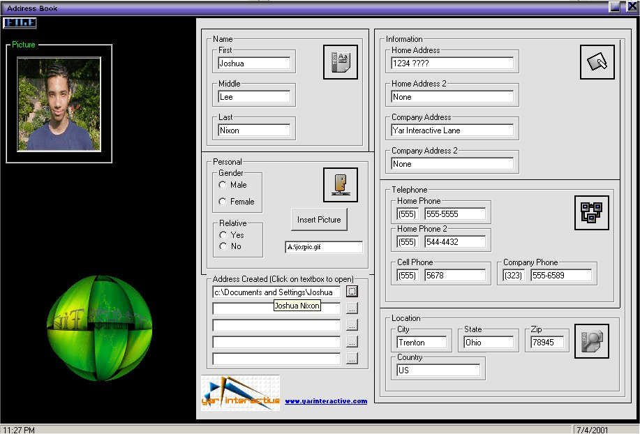

<div align="center">

## Cool Address Book


</div>

### Description

This a example on how to make an address book it show how to write to a new file created by you using print and loading it back by line input. It has a part where u can add up to 5 people at a time.
 
### More Info
 
Votes hopefully hahaha

none so far if any tell me please


<span>             |<span>
---                |---
**Submitted On**   |2001-07-04 23:36:58
**By**             |[Joshua Nixon](https://github.com/Planet-Source-Code/PSCIndex/blob/master/ByAuthor/joshua-nixon.md)
**Level**          |Intermediate
**User Rating**    |4.5 (49 globes from 11 users)
**Compatibility**  |VB 4\.0 \(16\-bit\), VB 4\.0 \(32\-bit\), VB 5\.0, VB 6\.0
**Category**       |[Coding Standards](https://github.com/Planet-Source-Code/PSCIndex/blob/master/ByCategory/coding-standards__1-43.md)
**World**          |[Visual Basic](https://github.com/Planet-Source-Code/PSCIndex/blob/master/ByWorld/visual-basic.md)
**Archive File**   |[Cool Addre22223752001\.zip](https://github.com/Planet-Source-Code/joshua-nixon-cool-address-book__1-24742/archive/master.zip)

### API Declarations

```
Private Declare Function ShellExecute Lib "shell32.dll" Alias "ShellExecuteA" (ByVal hwnd As Long, ByVal lpOperation As String, ByVal lpFile As String, ByVal lpParameters As String, ByVal lpDirectory As String, ByVal nShowCmd As Long) As Long
Private Declare Sub ReleaseCapture Lib "user32" ()
Private Declare Function SendMessage Lib "user32" Alias "SendMessageA" (ByVal hwnd As Long, ByVal wMsg As Long, ByVal wParam As Integer, ByVal lParam As Long) As Long
```


